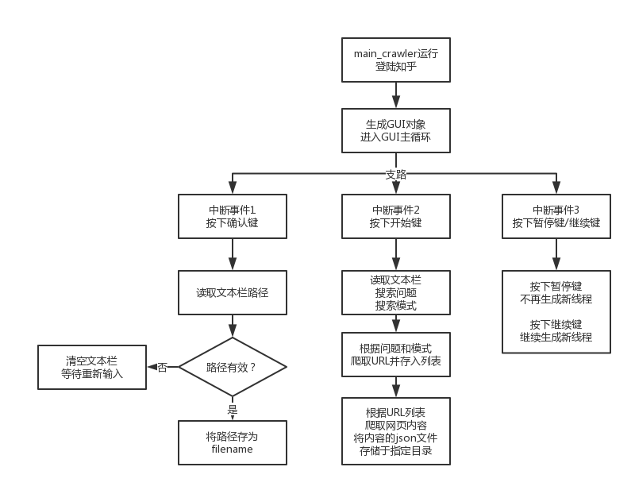
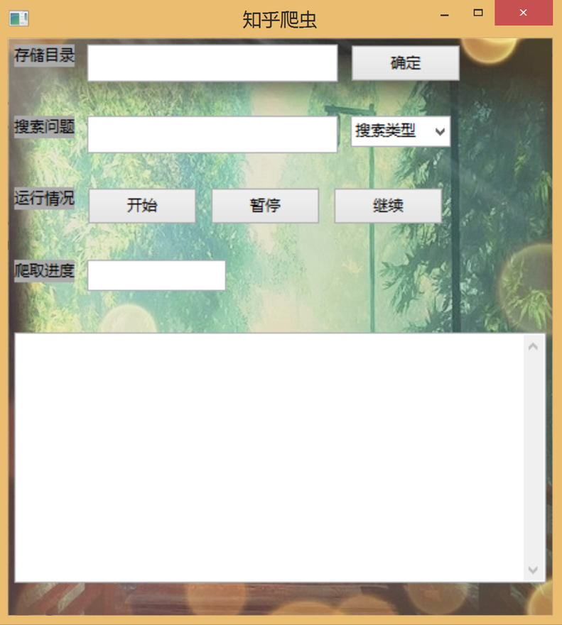
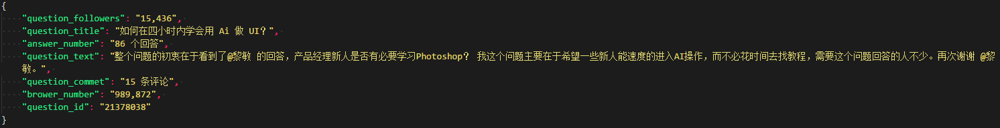
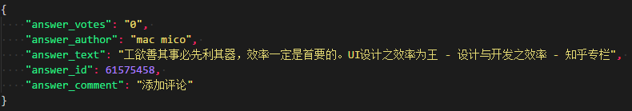

# ZhihuCrawler

## Software environment

* Operating system : Windows10 & Ubuntu 16.4
* IDE : PyCharm Community Edition 2017.2.3
* Python version : Python 3.6.3 |Anaconda, Inc.|

## Special library needed

* Wxpython : python GUI
* Selenium : python library that can simulate browser
* PhantomJS: path should be changed in the code 'URL.py' and 'crawl_question.py'

## Top Design


### main function



### Crawler


### GUI



## Result

### login


### .json





## Usage

````python

python main_controler.py

````

